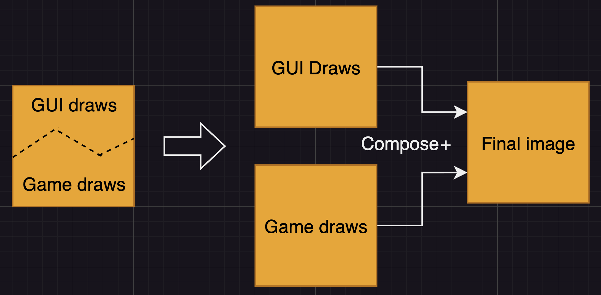

I'm thinking what I'd like to do with this site. I would like to describe some design patterns or mayhaps algorithms I've been trying to get my head around. I'm currently stumbling a lot over the Vulkan API trying to create a simple game engine, but the difficulty of the concepts make it quite hard to come up with clean extendable designs.

For example, how would you separate different rendering layers in your engine? Say you have your game world itself and a GUI overlay. Combining those rendering calls in a single class seems like it will easily complicate the architecture as unrelated data lives together.

An obvious solution to this increase of complexity would be to split up both of the presenters and let them individually control their drawing logic. As indicated in the following image.

But I've been jumping over some hurdles to find a correct design for this in Vulkan. My first thought was to have the Displayer be responsible for managing all images that will be rendered to, and having the presenters execute their draw calls when the Displayer needs them to be regenerated.This would make it easy for a presenter to start displaying something, and makes the displayer responsible for managing the framebuffer sizes. It has a major drawback though. For any pipeline to render it needs a renderpass. Since the renderpass would live on the Displayer it also has to provide it to the presenter as they will have to create render pipelines. The problem with that is that I don't want tight coupling between the presenters and the Displayer. So I had to find another solution.

I've come to the idea of having each renderer make their own images. This way the Displayer only needs to request this image via some kind of interface, like an 'image provider', and would make the Presenter not be reliable upon the Displayer. The drawback with this idea however is that we can't just depend on the requester the provide us the resolution of the image we're drawing into. As well as all the complexity of creating and rendering to an image _for each presenter_.

I believe that this way will still be achievable to resize dynamically to the framebuffer size. As well as create simple renderpasses for each pipeline. But it'll be something to experiment with.

See you later

