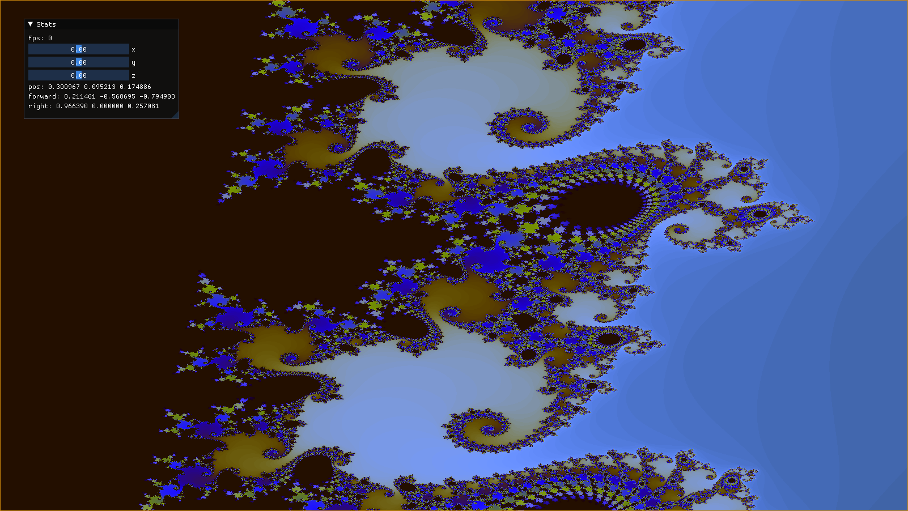
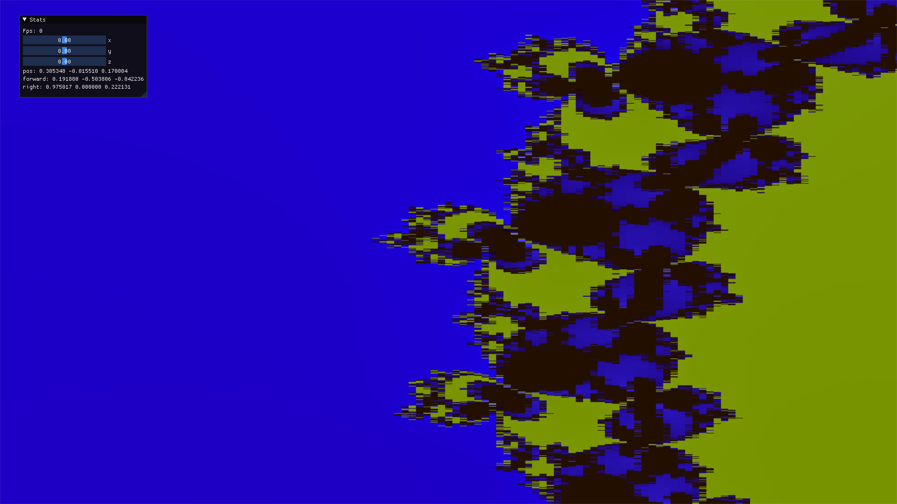

I have recently been tinkering with compute pipelines in Vulkan and complex numbers. And was finally able to display the mandelbrot set. The code is available in my [Github repo](https://github.com/angelocarly/VulkanEngine)

Artifacts because of floating point inaccuracy

#### Mandelbulb bonus

