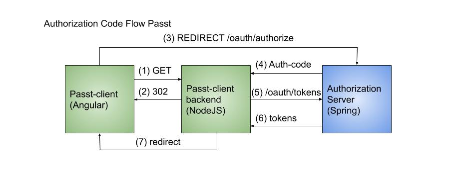

During my internship at Realdolmen, I was given the chance to write an OAuth2.0 Java Spring Boot Authentication manager
with a special focus on security. I took this chance and learned a great deal from the experience.

**Work in progress**

The following features were implemented:
- OAuth2.0
- JWT
- JWS
- SSL
- 2FA
- Refresh token revocation
- Geolocation

This project consists of 3 applications:
- [An identity provider server](https://github.com/angelocarly/Passt/tree/master/Passt-idp) that handles all the tokens and authentication.
- [An Angular frontend](https://github.com/angelocarly/Passt/tree/master/Passt-frontend) for the password manager.
- [A resource server](https://github.com/angelocarly/Passt/tree/master/Passt-sp) that acts as the link between the frontend and idp.

