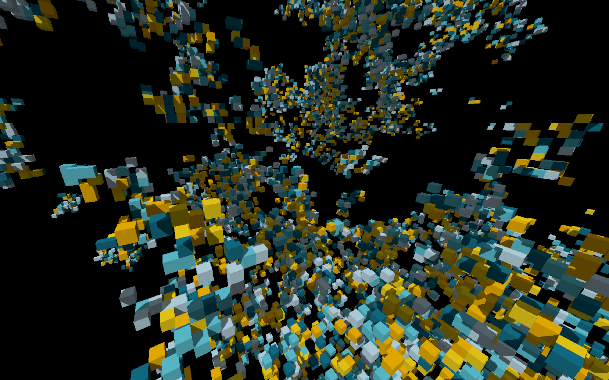
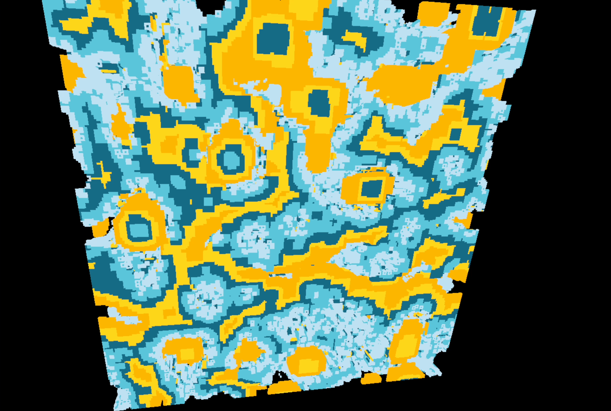

Vakarta - A game engine written using the Vulkan API.

I started this project as a general repository to keep my Vulkan Wrappers. Over time I extended the VKRT namespace to also manage more general game engine abstractions like Window setup, render targets, ImGui rendering. My goal is to expand a stable base for potential upcoming generative art projects of mine.

Currently I've written a simple 3D cellular automata renderer using Vakarta. I use compute shaders to perform the cell updates and use a DDA raytracing algorithm for rendering the voxel data.

The code is available in my [Github repo](https://github.com/angelocarly/Vakarta).

