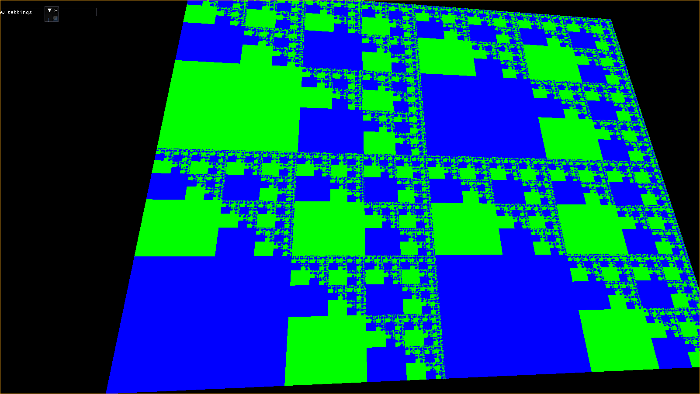
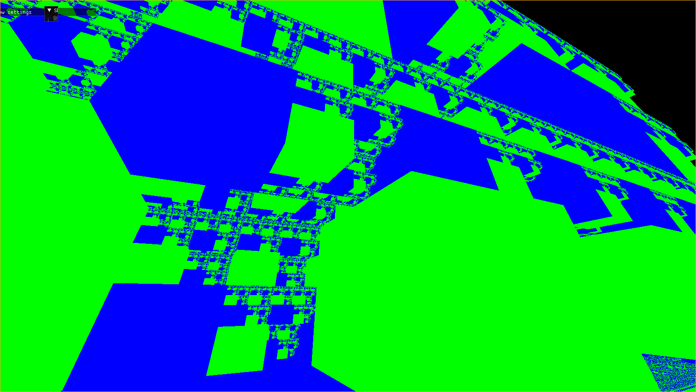
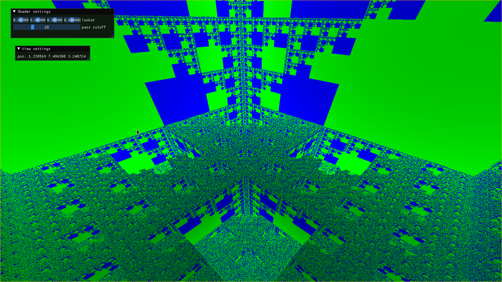
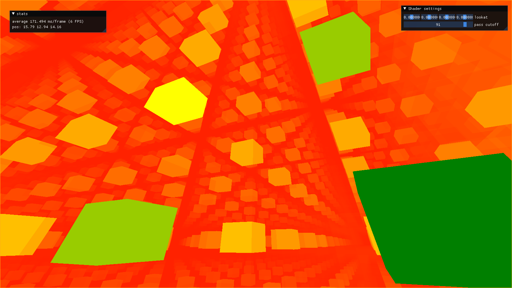
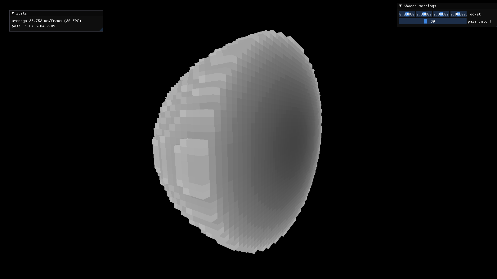
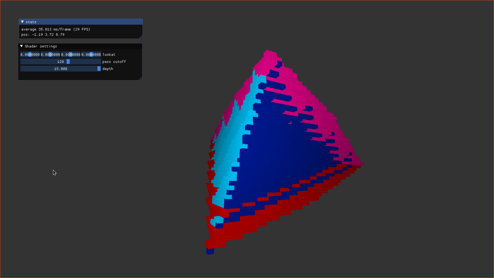
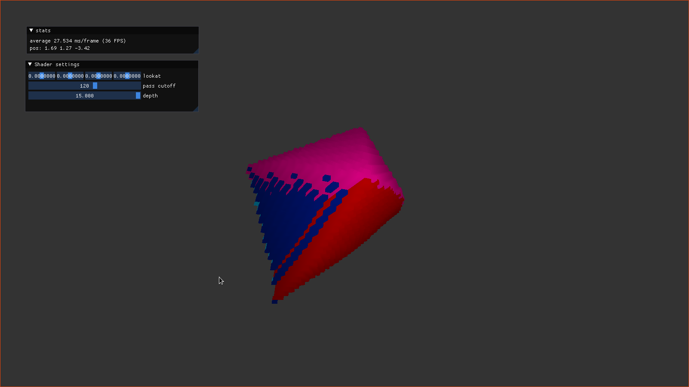
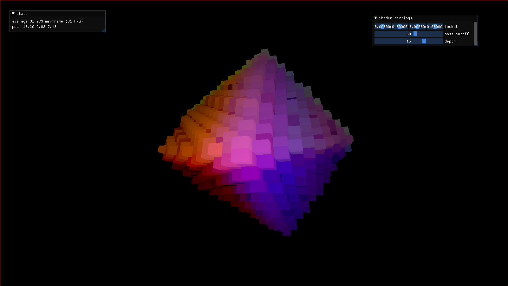
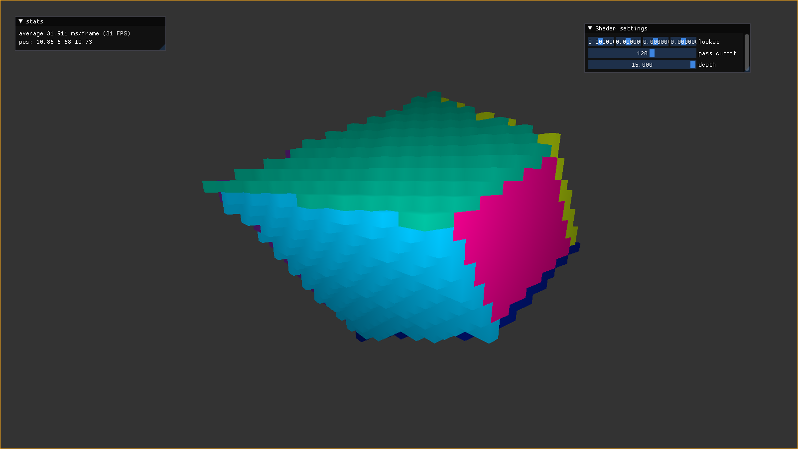

TODO: Add description of engine

You can view the source code or try this engine here: 
- [Github repo](https://github.com/angelocarly/vulkanengine)  

## Self referencing octrees

Performance view of the sparse octree traversal. Redder color means more passes.

## Hypersphere downprojection
Darker color means further in 4D space

## Hypercube downprojection
View of a hypercube angle where 4 normal cubes touch

Different viewing angles

