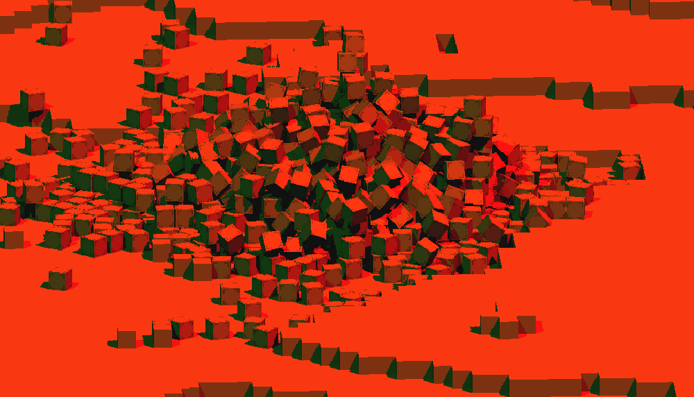

A game engine written in Java using the [LibGDX](https://libgdx.badlogicgames.com) game development library.

I really enjoyed tinkering with graphics in high school. So when I had some free time during my Java Programming lessons in college I tried to develop a small game engine. I didn't really set a goal for it, but wanted to be able to render voxels that integrates shadows/lighting and physics. I don't have a real finished product, but I'm happy with what I created.

The result is a small engine written using LibGDX in Java. It support directional lights, physics using JBullet and a destructible voxel terrain.

The physics were a challenging task, an unoptimized voxel engine is impossible to run on modern systems because you can't add every cube as a collidable object.
For example, this scene is about 32 blocks high, 256 blocks wide and 256 blocks in length. Then the physics engine would have to check 32*256*256 = 2097152 different instances of cubes. Not really achievable for my shitty laptop at the time. (But still not now)

To remedy this, I used a greedy meshing algorithm with the help of [this great writeup on 0fps.net](https://0fps.net/2012/06/30/meshing-in-a-minecraft-game/).
This algorithm basically tries to combine as much cubes in a single cube. Which makes it possible to combine everything in the scene into bigger and less objects. You can see this in the following screenshot which shows all the physics objects in the scene.

The better physics system allowed for some fun sandbox sessions.

You can view the source code or try this engine here: 
- [Github repo](https://github.com/angelocarly/xyzEngine)  
- [Binaries](https://github.com/angelocarly/xyzEngine/releases)
